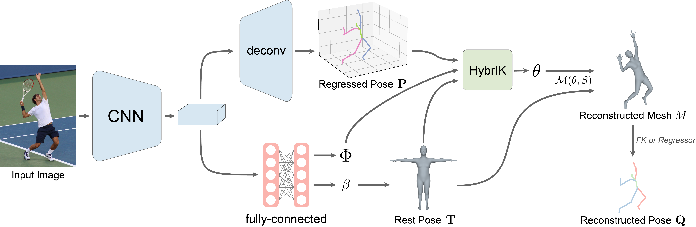

# HybrIK


This repo contains the code of our paper:

**HybrIK: A Hybrid Analytical-Neural Inverse Kinematics Solution for 3D Human Pose and Shape Estimation**

[Jiefeng Li](http://jeffli.site/HybrIK/), [Chao Xu](https://www.isdas.cn/), [Zhicun Chen](https://github.com/chenzhicun), [Siyuan Bian](https://github.com/biansy000), [Lixin Yang](https://lixiny.github.io/), [Cewu Lu](http://mvig.org/)

[[`arXiv`](https://arxiv.org/abs/2011.14672)]
[[`Project Page`](https://jeffli.site/HybrIK/)]

In CVPR 2021




<div align="center">
    <br>
    Twist-and-Swing Decomposition
</div>

## TODO
- [x] Provide pretrained model
- [x] Provide parsed data annotations

## Installation instructions

``` bash
# 1. Create a conda virtual environment.
conda create -n hybrik python=3.6 -y
conda activate hybrik

# 2. Install PyTorch
conda install pytorch==1.1.0 torchvision==0.3.0

# 3. Pull our code
git clone https://github.com/Jeff-sjtu/HybrIK.git
cd HybrIK

# 4. Install
python setup.py develop
```

## Download models
* Download the SMPL model `basicModel_neutral_lbs_10_207_0_v1.0.0.pkl` from [here](https://smpl.is.tue.mpg.de/) at `common/utils/smplpytorch/smplpytorch/native/models`.
* Download our pretrained model from [ [Google Drive]() | [Baidu]() ].

## Fetch data
Download *Human3.6M*, *MPI-INF-3DHP*, *3DPW* and *MSCOCO* datasets. You need to follow directory structure of the `data` as below.
```
|-- data
`-- |-- h36m
    `-- |-- annotations
        `-- images
`-- |-- pw3d
    `-- |-- json
        `-- imageFiles
`-- |-- 3dhp
    `-- |-- annotation_mpi_inf_3dhp_train.json
        |-- annotation_mpi_inf_3dhp_test.json
        |-- mpi_inf_3dhp_train_set
        `-- mpi_inf_3dhp_test_set
`-- |-- coco
    `-- |-- annotations
        |   |-- person_keypoints_train2017.json
        |   `-- person_keypoints_val2017.json
        |-- train2017
        `-- val2017
```
* Download Human3.6M parsed annotations. [ [Google](https://drive.google.com/drive/folders/1tLA_XeZ_32Qk86lR06WJhJJXDYrlBJ9r?usp=sharing) | [Baidu](https://pan.baidu.com/s/1bqfVOlQWX0Rfc0Yl1a5VRA) ]
* Download 3DPW parsed annotations. [ [Google](https://drive.google.com/file/d/1ICr1yIPKOtLn3LsTmcytvE-ZFokPsaw5/view?usp=sharing) | [Baidu](https://pan.baidu.com/s/1d42QyQmMONJgCJvHIU2nsA) ]
* Download MPI-INF-3DHP parsed annotations. [ [Google](https://drive.google.com/drive/folders/1Ms3s7nZ5Nrux3spLxmMMAQWc5aAIecmv?usp=sharing) | [Baidu](https://pan.baidu.com/s/1aVBDudbDRT1w_ZxQc9zicA) ]


## Train from scratch

``` bash
./scripts/train_smpl.sh train_res34 ./configs/256x192_adam_lr1e-3-res34_smpl_3d_base_2x_mix.yaml
```

## Evaluation
Download [pretrained model](https://drive.google.com/file/d/1SoVJ3dniVpBi2NkYfa2S8XEv0TGIK26l/view?usp=sharing).
``` bash
./scripts/validate_smpl.sh ./configs/256x192_adam_lr1e-3-res34_smpl_24_3d_base_2x_mix.yaml ./pretrained_res34.pth
```


## Citing
If our code helps your research, please consider citing the following paper:

    @inproceedings{li2020hybrik,
        title={HybrIK: A Hybrid Analytical-Neural Inverse Kinematics Solution for 3D Human Pose and Shape Estimation},
        author={Li, Jiefeng and Xu, Chao and Chen, Zhicun and Bian, Siyuan and Yang, Lixin and Lu, Cewu},
        booktitle={CVPR},
        year={2021}
    }
