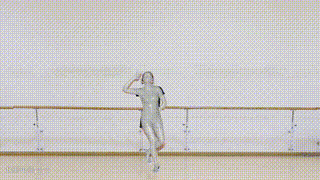
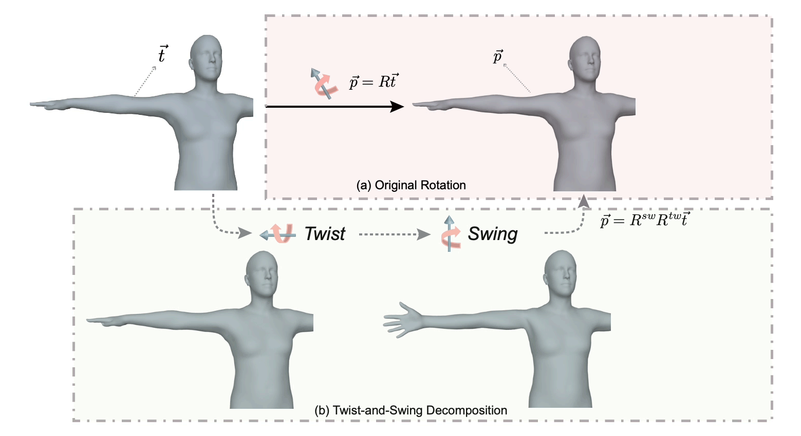
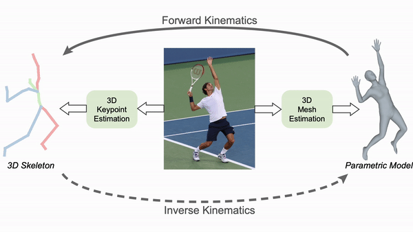

# HybrIK: Hybrid Analytical-Neural Inverse Kinematics for Body Mesh Recovery

<div align="center">
  
</br>
 
</div>

<div align="center">
<a href="https://pytorch.org/get-started/locally/"></a>
<a href='https://colab.research.google.com/drive/1n41l7I2NxWseuruVQEU8he2XqzSXhu2f?usp=sharing' style='padding-left: 0.5rem;'></a>
<a href='https://paperswithcode.com/sota/3d-human-pose-estimation-on-agora?p=hybrik-x-hybrid-analytical-neural-inverse' style='padding-left: 0.5rem;'>
</a>
</br>
<a href="https://arxiv.org/abs/2011.14672">
    
</a>
<a href="https://arxiv.org/abs/2304.05690">
    
</a>
<a href="https://youtu.be/xbdNFw2eZ4o">
    
</a>
<a href="https://youtu.be/VzCXKdQSZ7c">
    
</a>

</br>
</div>


This repo contains the code of our papers:

**HybrIK: A Hybrid Analytical-Neural Inverse Kinematics Solution for 3D Human Pose and Shape Estimation**, In CVPR 2021

**HybrIK-X: Hybrid Analytical-Neural Inverse Kinematics for Whole-body Mesh Recovery**, ArXiv 2023


<!--  -->

<!-- 
<div align="center">
    <br>
    Twist-and-Swing Decomposition
</div> -->

## News :triangular_flag_on_post:
[2023/06/02] Demo code for whole-body [HybrIK-X](https://arxiv.org/abs/2304.05690) is released.

[2022/12/03] HybrIK for Blender [add-on](https://github.com/Jeff-sjtu/HybrIK/releases/download/add-on/hybrik_blender_addon.zip) is now available for download. The output of HybrIK can be imported to Blender and saved as `fbx`.

[2022/08/16] [Pretrained model](https://drive.google.com/file/d/1C-jRnay38mJG-0O4_um82o1t7unC1zeT/view?usp=sharing) with HRNet-W48 backbone is available.

[2022/07/31] Training code with predicted camera is released.

[2022/07/25] [HybrIK](https://github.com/Jeff-sjtu/HybrIK) is now supported in [Alphapose](https://github.com/MVIG-SJTU/AlphaPose)! Multi-person demo with pose-tracking is available.

[2022/04/27] <a href='https://colab.research.google.com/drive/1n41l7I2NxWseuruVQEU8he2XqzSXhu2f?usp=sharing' style='padding-left: 0.5rem;'></a> is ready to use.

[2022/04/26] Achieve SOTA results by adding the 3DPW dataset for training.

[2022/04/25] The demo code is released!


## Key idea: Inverse Kinematics

HybrIK and HybrIK-X are based on a hybrid inverse kinematics (IK) to convert accurate 3D keypoints to parametric body meshes.

<div align="center">
    <br>
    Twist-and-Swing Decomposition
</div>


## Installation instructions

``` bash
# 1. Create a conda virtual environment.
conda create -n hybrik python=3.8 -y
conda activate hybrik

# 2. Install PyTorch
conda install pytorch==1.9.1 torchvision==0.10.1 -c pytorch

# 3. Install PyTorch3D (Optional, only for visualization)
conda install -c fvcore -c iopath -c conda-forge fvcore iopath
conda install -c bottler nvidiacub
pip install git+ssh://git@github.com/facebookresearch/pytorch3d.git@stable

# 4. Pull our code
git clone https://github.com/Jeff-sjtu/HybrIK.git
cd HybrIK

# 5. Install
pip install pycocotools
python setup.py develop  # or "pip install -e ."
```

Download necessary model files from [[Google Drive](https://drive.google.com/file/d/1un9yAGlGjDooPwlnwFpJrbGHRiLaBNzV/view?usp=sharing) | [Baidu](https://pan.baidu.com/s/1hVrUOt2QX_UTs4QuAgN2Lg?pwd=2u3c) (code: `2u3c`) ] and un-zip them in the `${ROOT}` directory.


## MODEL ZOO

### HybrIK (SMPL)

| Backbone | Training Data |     PA-MPJPE (3DPW)     | MPJPE (3DPW) | PA-MPJPE (Human3.6M) | MPJPE (Human3.6M) |  Download | Config |  
|----------|----------|------------|------------|-------|-----------|--------|--------------|
| ResNet-34          | w/ 3DPW | 44.5 | 72.4 | 33.8 | 55.5 | [model](https://drive.google.com/file/d/19ktHbERz0Un5EzJYZBdzdzTrFyd9gLCx/view?usp=share_link) | [cfg](./configs/256x192_adam_lr1e-3-res34_smpl_3d_cam_2x_mix_w_pw3d.yaml)    |
| HRNet-W48           | w/o 3DPW | 48.6 | 88.0 | 29.5 | 50.4 | [model](https://drive.google.com/file/d/1o3z99bebm2XImElc3XEUzTNVhQboGJE9/view?usp=share_link) | [cfg](./configs/256x192_adam_lr1e-3-hrw48_cam_2x_wo_pw3d.yaml)    |
| HRNet-W48          | w/ 3DPW | 41.8 | 71.3 | 29.8 | 47.1 | [model](https://drive.google.com/file/d/1gp3549vIEKfbc8SDQ-YF3Idi1aoR3DkW/view?usp=share_link) | [cfg](configs/256x192_adam_lr1e-3-hrw48_cam_2x_w_pw3d_3dhp.yaml)    |

### HybrIK-X (SMPL-X)
| Backbone |     MVE (AGORA Test)     | MPJPE (AGORA Test) |  Download | Config |  
|----------|------------|------------|-------|--------------|
| HRNet-W48           | 134.1 | 127.5 | [model](https://drive.google.com/file/d/1bKIPD60z_Im4S3W2-rew6YtOtUGff6-v/view?usp=sharing) | [cfg](configs/smplx/256x192_hrnet_smplx_kid.yaml)    |
| HRNet-W48 + [RLE](https://github.com/Jeff-sjtu/res-loglikelihood-regression/tree/203dc3195ee5a11ed6f47c066ffdb83247511359)          | 112.1 | 107.6 | [model](https://drive.google.com/file/d/1R0WbySXs_vceygKg_oWeLMNAZCEoCadG/view?usp=sharing) | [cfg](configs/smplx/256x192_hrnet_rle_smplx_kid.yaml)    |


## Demo
First make sure you download the pretrained model (with predicted camera) and place it in the `${ROOT}/pretrained_models` directory, i.e., `./pretrained_models/hybrik_hrnet.pth` and `./pretrained_models/hybrikx_rle_hrnet.pth`.

### SMPL

* Visualize HybrIK on **videos** (run in single frame) and save results:

``` bash
python scripts/demo_video.py --video-name examples/dance.mp4 --out-dir res_dance --save-pk --save-img
```
The saved results in `./res_dance/res.pk` can be imported to Blender with our [add-on](https://github.com/Jeff-sjtu/HybrIK/releases/download/add-on/hybrik_blender_addon.zip).

* Visualize HybrIK on **images**:

``` bash
python scripts/demo_image.py --img-dir examples --out-dir res
```

### SMPL-X

``` bash
python scripts/demo_video_x.py --video-name examples/dance.mp4 --out-dir res_dance --save-pk --save-img
```

## Fetch data
Download *Human3.6M*, *MPI-INF-3DHP*, *3DPW* and *MSCOCO* datasets. You need to follow directory structure of the `data` as below. Thanks to the great job done by Moon *et al.*, we use the Human3.6M images provided in [PoseNet](https://github.com/mks0601/3DMPPE_POSENET_RELEASE).
```
|-- data
`-- |-- h36m
    `-- |-- annotations
        `-- images
`-- |-- pw3d
    `-- |-- json
        `-- imageFiles
`-- |-- 3dhp
    `-- |-- annotation_mpi_inf_3dhp_train.json
        |-- annotation_mpi_inf_3dhp_test.json
        |-- mpi_inf_3dhp_train_set
        `-- mpi_inf_3dhp_test_set
`-- |-- coco
    `-- |-- annotations
        |   |-- person_keypoints_train2017.json
        |   `-- person_keypoints_val2017.json
        |-- train2017
        `-- val2017
```
* Download Human3.6M parsed annotations. [ [Google](https://drive.google.com/drive/folders/1tLA_XeZ_32Qk86lR06WJhJJXDYrlBJ9r?usp=sharing) | [Baidu](https://pan.baidu.com/s/1bqfVOlQWX0Rfc0Yl1a5VRA) ]
* Download 3DPW parsed annotations. [ [Google](https://drive.google.com/drive/folders/1f7DyxyvlC9z6SFT37eS6TTQiUOXVR9rK?usp=sharing) | [Baidu](https://pan.baidu.com/s/1d42QyQmMONJgCJvHIU2nsA) ]
* Download MPI-INF-3DHP parsed annotations. [ [Google](https://drive.google.com/drive/folders/1Ms3s7nZ5Nrux3spLxmMMAQWc5aAIecmv?usp=sharing) | [Baidu](https://pan.baidu.com/s/1aVBDudbDRT1w_ZxQc9zicA) ]


## Train from scratch

``` bash
./scripts/train_smpl_cam.sh test_3dpw configs/256x192_adam_lr1e-3-res34_smpl_3d_cam_2x_mix_w_pw3d.yaml
```

## Evaluation
Download the pretrained model ([ResNet-34](https://drive.google.com/file/d/16Y_MGUynFeEzV8GVtKTE5AtkHSi3xsF9/view?usp=sharing) or [HRNet-W48](https://drive.google.com/file/d/1C-jRnay38mJG-0O4_um82o1t7unC1zeT/view?usp=sharing)).
``` bash
./scripts/validate_smpl_cam.sh ./configs/256x192_adam_lr1e-3-hrw48_cam_2x_w_pw3d_3dhp.yaml ./pretrained_hrnet.pth
```


## Citing
If our code helps your research, please consider citing the following paper:

    @inproceedings{li2021hybrik,
        title={Hybrik: A hybrid analytical-neural inverse kinematics solution for 3d human pose and shape estimation},
        author={Li, Jiefeng and Xu, Chao and Chen, Zhicun and Bian, Siyuan and Yang, Lixin and Lu, Cewu},
        booktitle={Proceedings of the IEEE/CVF Conference on Computer Vision and Pattern Recognition},
        pages={3383--3393},
        year={2021}
    }

    @article{li2023hybrik,
        title={HybrIK-X: Hybrid Analytical-Neural Inverse Kinematics for Whole-body Mesh Recovery},
        author={Li, Jiefeng and Bian, Siyuan and Xu, Chao and Chen, Zhicun and Yang, Lixin and Lu, Cewu},
        journal={arXiv preprint arXiv:2304.05690},
        year={2023}
    }