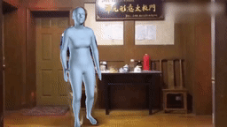

# HybrIK

[](https://paperswithcode.com/sota/3d-human-pose-estimation-on-3dpw?p=hybrik-a-hybrid-analytical-neural-inverse)

<div align="center">
 
</div>


This repo contains the code of our paper:

**HybrIK: A Hybrid Analytical-Neural Inverse Kinematics Solution for 3D Human Pose and Shape Estimation**

[Jiefeng Li](http://jeffli.site/HybrIK/), [Chao Xu](https://www.isdas.cn/), [Zhicun Chen](https://github.com/chenzhicun), [Siyuan Bian](https://github.com/biansy000), [Lixin Yang](https://lixiny.github.io/), [Cewu Lu](http://mvig.org/)

[[`Paper`](https://openaccess.thecvf.com/content/CVPR2021/html/Li_HybrIK_A_Hybrid_Analytical-Neural_Inverse_Kinematics_Solution_for_3D_Human_CVPR_2021_paper.html)]
[[`Supplementary Material`](https://openaccess.thecvf.com/content/CVPR2021/supplemental/Li_HybrIK_A_Hybrid_CVPR_2021_supplemental.zip)]
[[`arXiv`](https://arxiv.org/abs/2011.14672)]
[[`Project Page`](https://jeffli.site/HybrIK/)]

In CVPR 2021


<div align="center">
    <br>
    Twist-and-Swing Decomposition
</div>

## News :triangular_flag_on_post:
[2022/04/26] The demo code is released!


## TODO
- [x] Provide pretrained model
- [x] Provide parsed data annotations

## Installation instructions

``` bash
# 1. Create a conda virtual environment.
conda create -n hybrik python=3.7 -y
conda activate hybrik

# 2. Install PyTorch
conda install pytorch==1.6.0 torchvision==0.7.0 -c pytorch

# 3. Pull our code
git clone https://github.com/Jeff-sjtu/HybrIK.git
cd HybrIK

# 4. Install
python setup.py develop
```

## Download models
* Download the SMPL model `basicModel_neutral_lbs_10_207_0_v1.0.0.pkl` from [here](https://smpl.is.tue.mpg.de/) at `common/utils/smplpytorch/smplpytorch/native/models`.
* Download our pretrained model (paper version) from [ [Google Drive](https://drive.google.com/file/d/1SoVJ3dniVpBi2NkYfa2S8XEv0TGIK26l/view?usp=sharing) | [Baidu](https://pan.baidu.com/s/13rPFHO6FWoy7DK066XY1Fw) (code: `qre2`) ].
* Download our pretrained model (with predicted camera) from [ [Google Drive](https://drive.google.com/file/d/16Y_MGUynFeEzV8GVtKTE5AtkHSi3xsF9/view?usp=sharing) | [Baidu](https://pan.baidu.com/s/1kHTKQEKiPnrAKAUzOD-Xww) (code: `4qyv`) ].

## Demo
First make sure you download the pretrained model (with predicted camera) and place it in the `${ROOT}` directory, i.e., `./pretrained_w_cam.pth`.

* Visualize HybrIK on **videos** (run in single frame):

``` bash
python scripts/demo_video.py --video-name examples/dance.mp4
```


* Visualize HybrIK on **images**:

``` bash
python scripts/demo_image.py --img-dir examples
```


## Fetch data
Download *Human3.6M*, *MPI-INF-3DHP*, *3DPW* and *MSCOCO* datasets. You need to follow directory structure of the `data` as below. Thanks to the great job done by Moon *et al.*, we use the Human3.6M images provided in [PoseNet](https://github.com/mks0601/3DMPPE_POSENET_RELEASE).
```
|-- data
`-- |-- h36m
    `-- |-- annotations
        `-- images
`-- |-- pw3d
    `-- |-- json
        `-- imageFiles
`-- |-- 3dhp
    `-- |-- annotation_mpi_inf_3dhp_train.json
        |-- annotation_mpi_inf_3dhp_test.json
        |-- mpi_inf_3dhp_train_set
        `-- mpi_inf_3dhp_test_set
`-- |-- coco
    `-- |-- annotations
        |   |-- person_keypoints_train2017.json
        |   `-- person_keypoints_val2017.json
        |-- train2017
        `-- val2017
```
* Download Human3.6M parsed annotations. [ [Google](https://drive.google.com/drive/folders/1tLA_XeZ_32Qk86lR06WJhJJXDYrlBJ9r?usp=sharing) | [Baidu](https://pan.baidu.com/s/1bqfVOlQWX0Rfc0Yl1a5VRA) ]
* Download 3DPW parsed annotations. [ [Google](https://drive.google.com/file/d/1ICr1yIPKOtLn3LsTmcytvE-ZFokPsaw5/view?usp=sharing) | [Baidu](https://pan.baidu.com/s/1d42QyQmMONJgCJvHIU2nsA) ]
* Download MPI-INF-3DHP parsed annotations. [ [Google](https://drive.google.com/drive/folders/1Ms3s7nZ5Nrux3spLxmMMAQWc5aAIecmv?usp=sharing) | [Baidu](https://pan.baidu.com/s/1aVBDudbDRT1w_ZxQc9zicA) ]


## Train from scratch

``` bash
./scripts/train_smpl.sh train_res34 ./configs/256x192_adam_lr1e-3-res34_smpl_3d_base_2x_mix.yaml
```

## Evaluation
Download the pretrained model [[Google Drive](https://drive.google.com/file/d/1SoVJ3dniVpBi2NkYfa2S8XEv0TGIK26l/view?usp=sharing)].
``` bash
./scripts/validate_smpl.sh ./configs/256x192_adam_lr1e-3-res34_smpl_24_3d_base_2x_mix.yaml ./pretrained_res34.pth
```


## Results

<center>

| Method | 3DPW | Human3.6M |
|:-------|:-----:|:-------:|
| SPIN | 59.2 | 41.1 |
| VIBE | 56.5 | 41.5 |
| VIBE *w. 3DPW* | 51.9 | 41.4 |
| PARE | 49.3 | - |
| PARE *w. 3DPW* | 46.4 | - |
| **HybrIK** | **48.8** | **34.5** |
| **HybrIK** *w. 3DPW* | **45.3** | **36.3** |

</center>


## Citing
If our code helps your research, please consider citing the following paper:

    @inproceedings{li2021hybrik,
        title={Hybrik: A hybrid analytical-neural inverse kinematics solution for 3d human pose and shape estimation},
        author={Li, Jiefeng and Xu, Chao and Chen, Zhicun and Bian, Siyuan and Yang, Lixin and Lu, Cewu},
        booktitle={Proceedings of the IEEE/CVF Conference on Computer Vision and Pattern Recognition},
        pages={3383--3393},
        year={2021}
    }